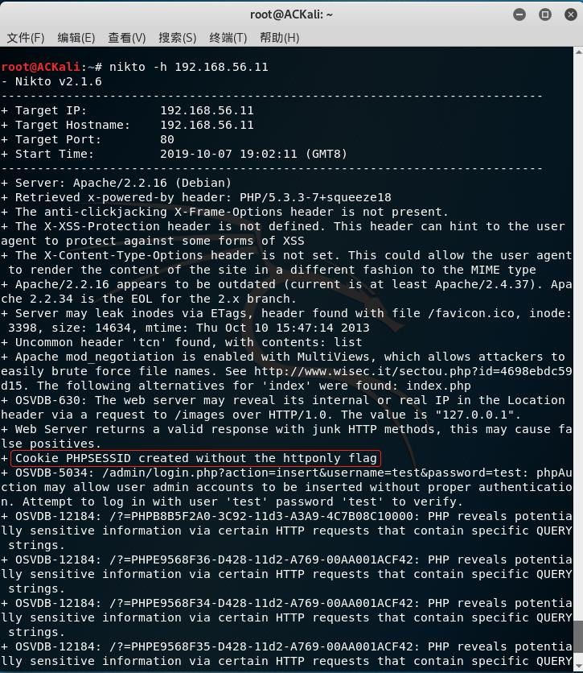
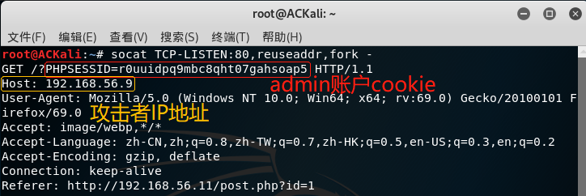

# 跨站脚本(XSS)攻击
## 实验过程
### 漏洞网站准备
- 在[Files for XSS and MySQL FILE](https://pentesterlab.com/exercises/xss_and_mysql_file/attachments)下载iso文件
- 使用虚拟机加载, 配置一块`Host-Only`网卡
- 虚拟机成功运行后, 宿主机(及同网段的虚拟机)可使用虚拟机IP地址访问该漏洞网站
### 设置虚拟机root密码
- `sudo bash`直接进入root模式
- `passwd`设置新的管理员密码
### 查看admin密码
- `cat /var/www/classes/db.php`查看调用的数据库为`blog`, 同时可以查看到管理员的用户名和密码
- `cat /var/www/classes/user.php`查看用户登录时查找的数据库表格`users`
- 登录数据库, `select * from users`, 获得`admin`密码的md5哈希值, 使用在线工具破解获得密码`P4ssw0rd`
- 实际上应该使用`SQL`注入来获得管理员密码, 但本实验重点是`XSS`攻击, 攻击者并非通过使用管理员用户名密码登录来获得管理员权限, 因此只是简单地获得管理员密码来模拟登录
### 普通用户获得admin权限
- 使用`nikto –h server-ipaddr`可查看网站漏洞
  - 用户可通过改变cookie来获得管理员权限 
    
- 提交评论``
  - `malicious`为攻击者的IP地址
- `socat TCP-LISTEN:80,reuseaddr,fork -`在攻击者主机上对80端口进行监听
- 使用靶机登录admin账户并查看评论, 正在监听的攻击者就可以获得admin账户的Cookie: 
  
- 获得cookie后, 使用开发者工具-控制台修改`document.cookie`, 无需知道密码即可成功获得管理员权限
## 实验总结
- 用户提交的数据需要经过转义之后才能展示
- `PHPSSID`应设置`httponly`, 避免`Cookie`的滥用