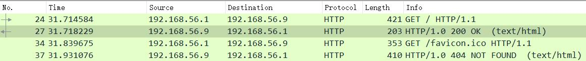
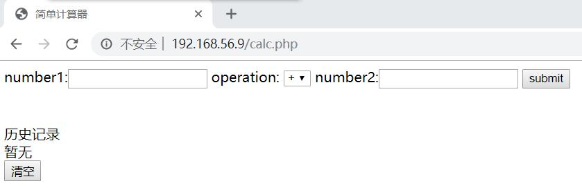

## 基本静态网页HTML的建立
### 使用Flask
- Python代码
```py
from flask import Flask, render_template
app = Flask(__name__)
@app.route('/')
def hello():
    return "Hello World!"
if __name__ == "__main__":
    app.run(host = "192.168.56.9", port = 80)
    # 虚拟机Host-Only网卡对应的IP地址
```
- 虚拟机上运行, 主机访问抓包
  - HTTP响应过程<br>
    <br>
    由于并没有`favicon.ico`图标文件, 因此返回`404`是正常的
  - 返回包里可以直接看到`Hello World!`:<br>
    
## 制作简单的动态网页
### `Apache2`安装与启动方法
```bash
sudo apt install apache2
sudo service apache2 start
```
### 简单计算器
- `/var/www/html/calc.php`
```php
<!DOCTYPE html>
<html lang="en">
<head>
    <meta charset="UTF-8">
    <title>简单计算器</title>
</head>
<body>
<form action="" method="get">
number1:<input type="text" name="num1">
operation:
<select name="op">
<option value="+">+</option>
<option value="-">-</option>
<option value="*">*</option>
<option value="/">/</option>
</select>
number2:<input type="text" name="num2">
<input type="submit" value="submit">
</form>
<?php
    // 判断是否submit
    if(isset($_GET["num1"]) && isset($_GET["num2"]))
    {
        if(!is_numeric($_GET["num1"]) || !is_numeric($_GET["num2"])){
        echo "One of the input is not number!";
        }
        else{
            if($_GET['op']=='/' && $_GET["num2"]==0){
                echo "Divisor can not be zero!";
            }
            else{
                echo "Answer: ";
                if($_GET['op']=='+'){
                    echo $_GET["num1"]+$_GET["num2"];
                }
                if($_GET['op']=='-'){
                    echo $_GET["num1"]-$_GET["num2"];
                }
                if($_GET['op']=='*'){
                    echo $_GET["num1"]*$_GET["num2"];
                }
                if($_GET['op']=='/'){
                    echo $_GET["num1"]/$_GET["num2"];
                }
            }
        }
    }
?>
</body>
</html>
```
### 数据库的使用
```bash
create database <DB name>;   #创建数据库
show databases;

use <DB Name>;  #switch the database
```
- 在数据库中存储历史计算结果
    ```php
    $connect = mysqli_connect('localhost','yanhui','Kali','calc');
        if(!$connect){
            die("Connected failed:".mysqli_connect_error());
        }
    $sql = "INSERT INTO hisans VALUES('".$_GET["num1"]."','".$_GET["num2"]."','".$_GET["op"]."','".$ans."')";
        if(!mysqli_query($connect, $sql))
            echo "<br>Error:".$sql."<br>".mysqli_error($connect);
    mysqli_close($connect);
    ```
- 读取历史记录
    ```php
    <?php
    $connect = mysqli_connect('localhost','yanhui','Kali','calc');
    if(!$connect){
        die("Connected failed:".mysqli_connect_error());
    }
    $sql = "select * from hisans";
    $res = mysqli_query($connect, $sql);
    echo "<br>历史记录<br>";
    if(mysqli_num_rows($res) > 0)
    {
        while($row = mysqli_fetch_assoc($res))
        {
            echo $row['num1'].$row['op'].$row['num2'].'='.$row['ans'].'<br>';
        }
    }
    else echo "暂无<br>";
    mysqli_close($connect);
    ?>
    ```
- 清空历史记录
    ```php
    <button onclick="clear();reload();">清空</button>
    <script type="text/javascript">
        function clear(){
            <?php
            $connect = mysqli_connect('localhost','yanhui','Kali','calc');
            if(!$connect){
                die("Connected failed:".mysqli_connect_error());
            }
            $sql = "DELETE from hisans";
            if(!mysqli_query($connect, $sql))
                echo "<br>Error:".$sql."<br>".mysqli_error($connect);
            mysqli_close($connect);
            ?>
        }
        function reload()
        {
            location.href='calc.php';   //刷新页面
        }
    </script>
    ```
### 最终界面
- 服务器搭建在虚拟机内, 使用宿主机访问<br>
    
### 参考资料
- [MYSQL Command Line Tutorial – Kali Linux](https://www.yeahhub.com/mysql-command-line-tutorial-kali-linux/)
- [PHP - Connection failed: Access denied for user 'username'@'localhost'](https://stackoverflow.com/questions/38159930/php-connection-failed-access-denied-for-user-usernamelocalhost-using-pa)