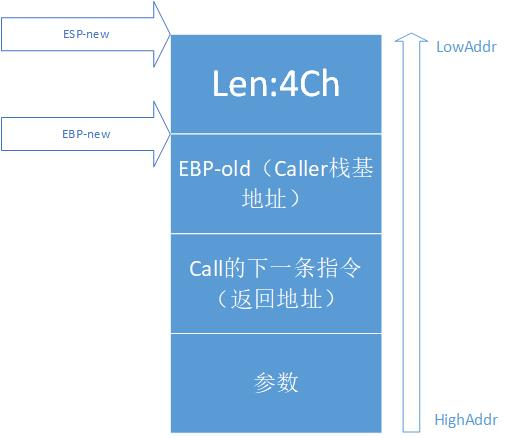
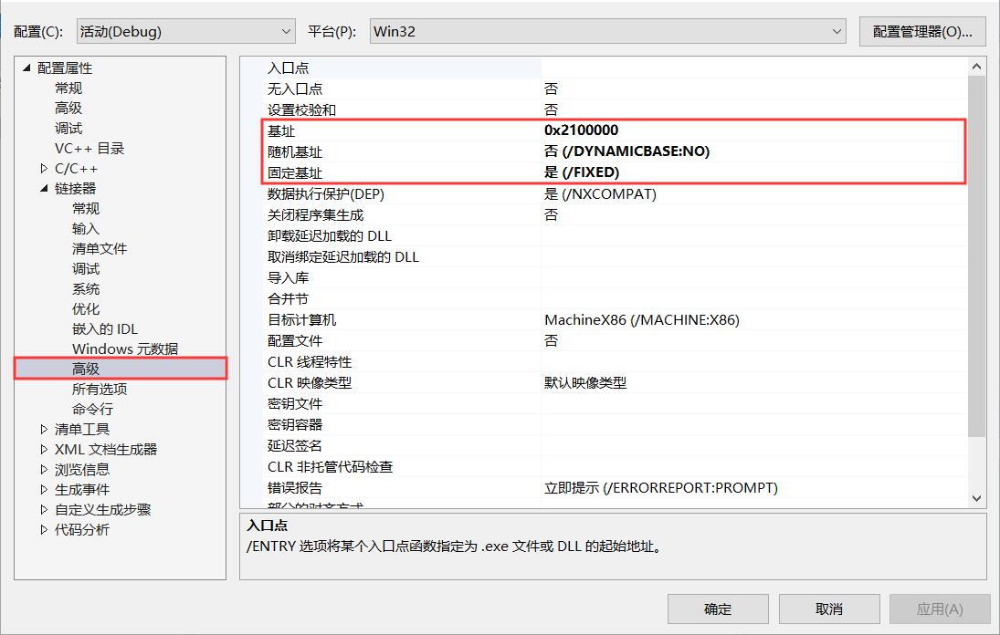

# 缓冲区溢出-反汇编代码观察与分析
## 实验过程
### 含漏洞的代码`source.c`
```c
#define _CRT_SECURE_NO_WARNINGS
#include <stdlib.h>
#include <stdio.h>
#include <string.h>
int sub(char* x)
{
    char y[10];
    strcpy(y, x);
    return 0;
}
int main(int argc, char** argv)
{
    if (argc > 1)
        sub(argv[1]);
    printf("exit");
}
```
### 修改项目属性


### 逐步运行代码并观察
- 先填写一个较短的输入参数(不含有空格):<br>
  
- 将断点下在`sub(argv[1])`语句上
- 调试模式, 运行后在`main`函数内部右键转到反汇编, 再右键取消`显示符号名`
- `调试 -> 窗口`打开`内存`和`寄存器`窗口
- 在查看反汇编模式下进行单步调试, `EIP`每次都会变, 值对应当前执行的指令所在的地址, 是指令指针寄存器
- 当执行`call`指令时, 会将下一条指令的地址压入栈中, 栈顶指针寄存器`ESP`将会减少`0x4`(栈底在高地址)
- 调用子函数`sub`, 为其分配空间, `ESP`移动的距离会跟函数中的局部变量有关:<br>
  <br>
- 函数返回时, 将当前`EBP`赋值给`ESP`, 弹出原来栈中存储的旧的`EBP`的值并赋给`EBP`, 弹出返回地址到`EIP`执行下一条命令
- 在没有超过数组`char y[10]`范围的情况下, 函数可以正常执行
- 再次修改输入参数, 长度超过10(不含空格):<br>
  
- `[ebp + ]`表示参数, `[ebp - ]`表示局部变量, 为`y`数组赋值将从低地址向高地址填写, 由于并没有分配那么多空间, 超出的部分将会直接覆盖栈中存储的`EBP-old`、返回地址和参数等值, 从而运行错误
- 由于覆盖, 函数返回失败:<br>
  
### 利用缓冲区溢出运行指定函数
- 固定程序运行的基址: <br>

- 添加一个函数, 正常运行时并不会被调用:
    ```c
    void Hack()
    {
        printf("You stepped into a pitfall.\n");
    }
    ```
- 运行程序, 查看`Hack`函数的位置: <br>

- 由于存在不可打印字符, 将原程序中`if (argc > 1) sub(argv[1]);`修改为: <br>
  ```c
  char str[50] = "";
  sub(str);
  ```
- 根据之前运行出错的跳转找到对应跳转地址的字符, 修改字符串为`averyverylongstr\x80\x15\x11\x02`, 赋值给`str`
- 运行程序, 成功跳转至`Hack`函数:<br>

## 实验总结
- 在调用`strcpy`等函数前应检查参数长度, 避免缓冲区溢出而导致的运行错误
- 利用缓冲区溢出漏洞, 通过精心设定的参数, 可以诱导用户代码执行另外的程序