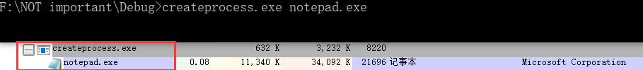

# `CreateThread`
## 实验过程
### 完整代码
```cpp
#include <windows.h>
#include <tchar.h>
#include <strsafe.h>

#define MAX_THREADS 10	//创建的线程数
#define BUF_SIZE 255
#define MULTI_THREAD

DWORD WINAPI MyThreadFunction(LPVOID lpParam);

// Sample custom data structure for threads to use.
// This is passed by void pointer so it can be any data type
// that can be passed using a single void pointer (LPVOID).
typedef struct MyData {
	int val1;
	int val2;
} MYDATA, * PMYDATA;

// 支持unicode, main函数的别名
int _tmain()
{
	PMYDATA pDataArray[MAX_THREADS];
#ifdef MULTI_THREAD
	DWORD   dwThreadIdArray[MAX_THREADS];
	HANDLE  hThreadArray[MAX_THREADS];
#endif

	// Create MAX_THREADS worker threads.

	DWORD start = GetTickCount();
	//The return value is the number of milliseconds that have elapsed since the system was started.

	for (int i = 0; i < MAX_THREADS; i++)
	{
		// Allocate memory for thread data.

		pDataArray[i] = (PMYDATA)malloc(sizeof(MYDATA));

		if (pDataArray[i] == NULL)
		{
			// If the array allocation fails, the system is out of memory
			// so there is no point in trying to print an error message.
			// Just terminate execution.
			ExitProcess(2);
		}

		// Generate unique data for each thread to work with.

		pDataArray[i]->val1 = i;
		pDataArray[i]->val2 = i + 100;

		// Create the thread to begin execution on its own.

#ifdef MULTI_THREAD

		hThreadArray[i] = CreateThread(
			NULL,                   // default security attributes
			0,                      // use default stack size  
			MyThreadFunction,       // thread function name
			pDataArray[i],          // argument to thread function 
			0,                      // use default creation flags 
			&dwThreadIdArray[i]);   // returns the thread identifier 

		// Check the return value for success.
		// If CreateThread fails, terminate execution. 
		// This will automatically clean up threads and memory. 

		if (hThreadArray[i] == NULL)
		{
			printf("CreateThread Error(%d)", GetLastError());
			ExitProcess(3);
		}
#else
		MyThreadFunction(pDataArray[i]);
#endif
	} // End of main thread creation loop.

	// Wait until all threads have terminated.
	// TRUE表示所有都要执行完毕才返回, FALSE只要有任意一个执行完毕就返回
    // INFINTE 无限等待
#ifdef MULTI_THREAD
	WaitForMultipleObjects(MAX_THREADS, hThreadArray, TRUE, INFINITE);
#endif

	DWORD end = GetTickCount();
	printf("tick count: %d\n", end - start);

	// Close all thread handles and free memory allocations.
#ifdef MULTI_THREAD

	for (int i = 0; i < MAX_THREADS; i++)
	{
		CloseHandle(hThreadArray[i]);
		if (pDataArray[i] != NULL)
		{
			free(pDataArray[i]);
			pDataArray[i] = NULL;    // Ensure address is not reused.
		}
	}
#endif
	return 0;
}

DWORD WINAPI MyThreadFunction(LPVOID lpParam)
{
	PMYDATA pDataArray;
	pDataArray = (PMYDATA)lpParam;
	Sleep(1000);
	//人为加长时间, 并发与串行间的区别更明显
	printf("Parameters = %d, %d\n", pDataArray->val1, pDataArray->val2);
	return 0;
}
```
### 并发执行, 多线程
直接运行上方代码, 可得以下结果: <br>

### 串行执行, 单线程
注释宏`#define MULTI_THREAD`然后编译运行代码, 可得以下结果: <br>

## 实验总结
- 每个线程里`Sleep(1000)`花费的时间占主要部分, `printf`花费的时间可以忽略不计, 因此每个线程执行完毕需要约`1000 tick count`
- 在第一次执行中总共也只花费了1000多一点的时间, 多出的时间推测是线程间切换导致的, 并且从打印结果可以看到, 各线程执行完毕的顺序与开始执行的顺序不同, 说明这些进程是并发执行的, 执行完毕与开始执行顺序不同是由并发导致的
- 第二次执行所花费的时间约为1000的十倍, 并且各线程执行完毕的顺序与开始执行的顺序相同, 说明这些进程是串行执行的
# `CreateProcess`
## 实验过程
### 完整代码
```cpp
#include <windows.h>
#include <stdio.h>
#include <tchar.h>

void _tmain( int argc, TCHAR *argv[] )
{
    STARTUPINFO si;
    PROCESS_INFORMATION pi;

    ZeroMemory( &si, sizeof(si) );
    si.cb = sizeof(si);
    ZeroMemory( &pi, sizeof(pi) );

    if( argc != 2 )
    {
        printf("Usage: %s [cmdline]\n", argv[0]);
        return;
    }

    // Start the child process. 
    if( !CreateProcess( NULL,   // No module name (use command line)
        argv[1],        // Command line
        NULL,           // Process handle not inheritable
        NULL,           // Thread handle not inheritable
        FALSE,          // Set handle inheritance to FALSE
        0,              // No creation flags
        NULL,           // Use parent's environment block
        NULL,           // Use parent's starting directory 
        &si,            // Pointer to STARTUPINFO structure
        &pi )           // Pointer to PROCESS_INFORMATION structure
    )
    {
        printf( "CreateProcess failed (%d).\n", GetLastError() );
        return;
    }

    // Wait until child process exits.
    WaitForSingleObject( pi.hProcess, INFINITE );

    // Close process and thread handles.
    CloseHandle( pi.hProcess );
    CloseHandle( pi.hThread );
}
```
### 创建进程与观察
- 使用命令行运行代码, 用`CreateProcess`调用记事本, 使用`ProcessExplorer`可以查看进程的父子关系<br>
  
- 还可以进行递归调用: <br>
  
## 实验总结
- `cmd`中引号嵌套可以使用`\`进行转义, 目前最多只能嵌套两层引号, 如: <br>
  ```bash
  createprocess.exe "createprocess.exe \"createprocess.exe notepad.exe\""
  ```
- 进程之间存在父子关系, 调用的进程是父进程, 被调用的为子进程