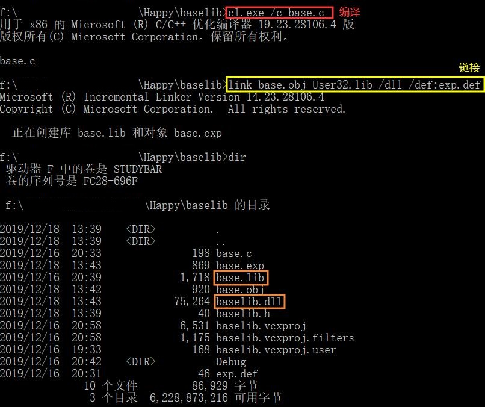
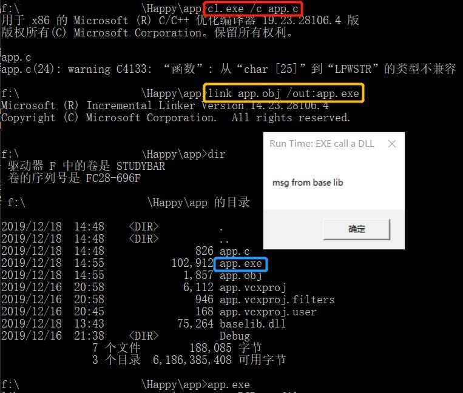

# 模块遍历

## 实验过程

### 待分析程序源代码 - `CreateThread.c`
```c
#include <windows.h>
#include <tchar.h>
#include <strsafe.h>

#define MAX_THREADS 10	//创建的线程数
#define BUF_SIZE 255
// #define MULTI_THREAD

DWORD WINAPI MyThreadFunction(LPVOID lpParam);

// Sample custom data structure for threads to use.
// This is passed by void pointer so it can be any data type
// that can be passed using a single void pointer (LPVOID).
typedef struct MyData {
	int val1;
	int val2;
} MYDATA, * PMYDATA;

// 支持unicode, main函数的别名
int _tmain()
{
	PMYDATA pDataArray[MAX_THREADS];
#ifdef MULTI_THREAD
	DWORD   dwThreadIdArray[MAX_THREADS];
	HANDLE  hThreadArray[MAX_THREADS];
#endif

	// Create MAX_THREADS worker threads.

	DWORD start = GetTickCount();
	//The return value is the number of milliseconds that have elapsed since the system was started.

	for (int i = 0; i < MAX_THREADS; i++)
	{
		// Allocate memory for thread data.

		pDataArray[i] = (PMYDATA)malloc(sizeof(MYDATA));

		if (pDataArray[i] == NULL)
		{
			// If the array allocation fails, the system is out of memory
			// so there is no point in trying to print an error message.
			// Just terminate execution.
			ExitProcess(2);
		}

		// Generate unique data for each thread to work with.

		pDataArray[i]->val1 = i;
		pDataArray[i]->val2 = i + 100;

		// Create the thread to begin execution on its own.

#ifdef MULTI_THREAD

		hThreadArray[i] = CreateThread(
			NULL,                   // default security attributes
			0,                      // use default stack size
			MyThreadFunction,       // thread function name
			pDataArray[i],          // argument to thread function
			0,                      // use default creation flags
			&dwThreadIdArray[i]);   // returns the thread identifier

		// Check the return value for success.
		// If CreateThread fails, terminate execution.
		// This will automatically clean up threads and memory.

		if (hThreadArray[i] == NULL)
		{
			printf("CreateThread Error(%d)", GetLastError());
			ExitProcess(3);
		}
#else
		MyThreadFunction(pDataArray[i]);
#endif
	} // End of main thread creation loop.

	// Wait until all threads have terminated.
	// TRUE表示所有都要执行完毕才返回, FALSE只要有任意一个执行完毕就返回
	// INFINTE 无限等待
#ifdef MULTI_THREAD
	WaitForMultipleObjects(MAX_THREADS, hThreadArray, TRUE, INFINITE);
#endif

	DWORD end = GetTickCount();
	printf("tick count: %d\n", end - start);

	// Close all thread handles and free memory allocations.
#ifdef MULTI_THREAD

	for (int i = 0; i < MAX_THREADS; i++)
	{
		CloseHandle(hThreadArray[i]);
		if (pDataArray[i] != NULL)
		{
			free(pDataArray[i]);
			pDataArray[i] = NULL;    // Ensure address is not reused.
		}
	}
#endif
	return 0;
}

DWORD WINAPI MyThreadFunction(LPVOID lpParam)
{
	PMYDATA pDataArray;
	pDataArray = (PMYDATA)lpParam;
	Sleep(10000);
	printf("Parameters = %d, %d\n", pDataArray->val1, pDataArray->val2);
	return 0;
}
```

### 使用`Taking a Snapshot and Viewing Processes`分析

#### 分析程序源代码

```c
#include <windows.h>
#include <tlhelp32.h> //tool help
#include <tchar.h>
#include <stdio.h>
#include <stdlib.h>

//  Forward declarations:
BOOL GetProcessList();
BOOL ListProcessModules(DWORD dwPID);
BOOL ListProcessThreads(DWORD dwOwnerPID);
void printError(TCHAR* msg);

int main(void)
{
	GetProcessList();
	Sleep(100);
	return 0;
}

BOOL GetProcessList()
{
	HANDLE hProcessSnap;
	HANDLE hProcess;
	PROCESSENTRY32 pe32;
	DWORD dwPriorityClass;

	// Take a snapshot of all processes in the system.
	hProcessSnap = CreateToolhelp32Snapshot(TH32CS_SNAPPROCESS, 0);
	if (hProcessSnap == INVALID_HANDLE_VALUE)
	{
		printError(TEXT("CreateToolhelp32Snapshot (of processes)"));
		return(FALSE);
	}

	// Set the size of the structure before using it.
	pe32.dwSize = sizeof(PROCESSENTRY32);

	// Retrieve information about the first process,
	// and exit if unsuccessful
	if (!Process32First(hProcessSnap, &pe32))
	{
		printError(TEXT("Process32First")); // show cause of failure
		CloseHandle(hProcessSnap);          // clean the snapshot object
		return(FALSE);
	}

	// Now walk the snapshot of processes, and
	// display information about each process in turn
	do
	{
		_tprintf(TEXT("\n%d\t%s"), pe32.th32ProcessID, pe32.szExeFile);

        // 只有当进程名为 CreateThread.exe 才对其进行分析
		if (lstrcmp(pe32.szExeFile, TEXT("CreateThread.exe")) == 0)
		{
			// Retrieve the priority class.
			dwPriorityClass = 0;
			hProcess = OpenProcess(PROCESS_ALL_ACCESS, FALSE, pe32.th32ProcessID);
			if (hProcess == NULL)
				printError(TEXT("OpenProcess"));
			else
			{
				dwPriorityClass = GetPriorityClass(hProcess);
				if (!dwPriorityClass)
					printError(TEXT("GetPriorityClass"));
				CloseHandle(hProcess);
			}

			_tprintf(TEXT("\n  Process ID        = 0x%08X"), pe32.th32ProcessID);
			_tprintf(TEXT("\n  Thread count      = %d"), pe32.cntThreads);
			_tprintf(TEXT("\n  Parent process ID = 0x%08X"), pe32.th32ParentProcessID);
			_tprintf(TEXT("\n  Priority base     = %d"), pe32.pcPriClassBase);
			if (dwPriorityClass)
				_tprintf(TEXT("\n  Priority class    = %d"), dwPriorityClass);

			// List the modules and threads associated with this process
			ListProcessModules(pe32.th32ProcessID);
			ListProcessThreads(pe32.th32ProcessID);
		}

	} while (Process32Next(hProcessSnap, &pe32)); //列表遍历

	CloseHandle(hProcessSnap);
	return(TRUE);
}


BOOL ListProcessModules(DWORD dwPID)
{
	HANDLE hModuleSnap = INVALID_HANDLE_VALUE;
	MODULEENTRY32 me32;

	// Take a snapshot of all modules in the specified process.
	hModuleSnap = CreateToolhelp32Snapshot(TH32CS_SNAPMODULE, dwPID);
	if (hModuleSnap == INVALID_HANDLE_VALUE)
	{
		printError(TEXT("CreateToolhelp32Snapshot (of modules)"));
		return(FALSE);
	}

	// Set the size of the structure before using it.
	me32.dwSize = sizeof(MODULEENTRY32);

	// Retrieve information about the first module,
	// and exit if unsuccessful
	if (!Module32First(hModuleSnap, &me32))
	{
		printError(TEXT("Module32First"));  // show cause of failure
		CloseHandle(hModuleSnap);           // clean the snapshot object
		return(FALSE);
	}

	// Now walk the module list of the process,
	// and display information about each module
	do
	{
		_tprintf(TEXT("\n\n     MODULE NAME:     %s"), me32.szModule);
		_tprintf(TEXT("\n     Executable     = %s"), me32.szExePath);
		_tprintf(TEXT("\n     Process ID     = 0x%08X"), me32.th32ProcessID);
		_tprintf(TEXT("\n     Ref count (g)  = 0x%04X"), me32.GlblcntUsage);
		_tprintf(TEXT("\n     Ref count (p)  = 0x%04X"), me32.ProccntUsage);
		_tprintf(TEXT("\n     Base address   = 0x%08X"), (DWORD)me32.modBaseAddr);
		_tprintf(TEXT("\n     Base size      = %d"), me32.modBaseSize);

	} while (Module32Next(hModuleSnap, &me32));

	CloseHandle(hModuleSnap);
	return(TRUE);
}

BOOL ListProcessThreads(DWORD dwOwnerPID)
{
	HANDLE hThreadSnap = INVALID_HANDLE_VALUE;
	THREADENTRY32 te32;

	// Take a snapshot of all running threads
	hThreadSnap = CreateToolhelp32Snapshot(TH32CS_SNAPTHREAD, 0);
	if (hThreadSnap == INVALID_HANDLE_VALUE)
		return(FALSE);

	// Fill in the size of the structure before using it. 
	te32.dwSize = sizeof(THREADENTRY32);

	// Retrieve information about the first thread,
	// and exit if unsuccessful
	if (!Thread32First(hThreadSnap, &te32))
	{
		printError(TEXT("Thread32First")); // show cause of failure
		CloseHandle(hThreadSnap);          // clean the snapshot object
		return(FALSE);
	}

	// Now walk the thread list of the system,
	// and display information about each thread
	// associated with the specified process
	do
	{
		if (te32.th32OwnerProcessID == dwOwnerPID)
		{
			_tprintf(TEXT("\n\n     THREAD ID      = 0x%08X"), te32.th32ThreadID);
			_tprintf(TEXT("\n     Base priority  = %d"), te32.tpBasePri);
			_tprintf(TEXT("\n     Delta priority = %d"), te32.tpDeltaPri);
			_tprintf(TEXT("\n"));
		}
	} while (Thread32Next(hThreadSnap, &te32));

	CloseHandle(hThreadSnap);
	return(TRUE);
}

void printError(TCHAR* msg)
{
	DWORD eNum;
	TCHAR sysMsg[256];
	TCHAR* p;

	eNum = GetLastError();
	FormatMessage(FORMAT_MESSAGE_FROM_SYSTEM | FORMAT_MESSAGE_IGNORE_INSERTS,
		NULL, eNum,
		MAKELANGID(LANG_NEUTRAL, SUBLANG_DEFAULT), // Default language
		sysMsg, 256, NULL);

	// Trim the end of the line and terminate it with a null
	p = sysMsg;
	while ((*p > 31) || (*p == 9))
		++p;
	do { *p-- = 0; } while ((p >= sysMsg) &&
		((*p == '.') || (*p < 33)));

	// Display the message
	_tprintf(TEXT("\n  WARNING: %s failed with error %d (%s)"), msg, eNum, sysMsg);
}
```

#### 分析结果
```bash
16560   CreateThread.exe
  Process ID        = 0x000040B0
  Thread count      = 1
  Parent process ID = 0x00000DC0
  Priority base     = 8
  Priority class    = 32

     MODULE NAME:     CreateThread.exe
     Executable     = F:\软件项目开发生命周期\CreateThread\Debug\CreateThread.exe
     Process ID     = 0x000040B0
     Ref count (g)  = 0xFFFF
     Ref count (p)  = 0xFFFF
     Base address   = 0x00DE0000
     Base size      = 131072

     MODULE NAME:     ntdll.dll
     Executable     = C:\WINDOWS\SYSTEM32\ntdll.dll
     Process ID     = 0x000040B0
     Ref count (g)  = 0xFFFF
     Ref count (p)  = 0xFFFF
     Base address   = 0x77730000
     Base size      = 1626112

     MODULE NAME:     KERNEL32.DLL
     Executable     = C:\WINDOWS\System32\KERNEL32.DLL
     Process ID     = 0x000040B0
     Ref count (g)  = 0xFFFF
     Ref count (p)  = 0xFFFF
     Base address   = 0x74760000
     Base size      = 851968

     MODULE NAME:     KERNELBASE.dll
     Executable     = C:\WINDOWS\System32\KERNELBASE.dll
     Process ID     = 0x000040B0
     Ref count (g)  = 0xFFFF
     Ref count (p)  = 0xFFFF
     Base address   = 0x77120000
     Base size      = 1929216

     MODULE NAME:     VCRUNTIME140D.dll
     Executable     = C:\WINDOWS\SYSTEM32\VCRUNTIME140D.dll
     Process ID     = 0x000040B0
     Ref count (g)  = 0x0001
     Ref count (p)  = 0x0001
     Base address   = 0x0F5D0000
     Base size      = 110592

     MODULE NAME:     ucrtbased.dll
     Executable     = C:\WINDOWS\SYSTEM32\ucrtbased.dll
     Process ID     = 0x000040B0
     Ref count (g)  = 0x0002
     Ref count (p)  = 0x0002
     Base address   = 0x0FAE0000
     Base size      = 1523712

     THREAD ID      = 0x0000356C
     Base priority  = 8
     Delta priority = 0
```

### 使用`dumpbin`分析

#### 分析方法

`dumpbin /imports CreateThread.exe`

#### 分析结果
```bash
Dump of file CreateThread.exe

File Type: EXECUTABLE IMAGE

  Section contains the following imports:

    KERNEL32.dll
                41B000 Import Address Table
                41B238 Import Name Table
                     0 time date stamp
                     0 Index of first forwarder reference

                   86 CloseHandle
                  261 GetLastError
                  57D Sleep
                  5D5 WaitForMultipleObjects
                  15E ExitProcess
                   F3 CreateThread
                  307 GetTickCount
                  1AB FreeLibrary
                  5CE VirtualQuery
                  2B4 GetProcessHeap
                  349 HeapFree
                  345 HeapAlloc
                  278 GetModuleHandleW
                  2D0 GetStartupInfoW
                  363 InitializeSListHead
                  2E9 GetSystemTimeAsFileTime
                  218 GetCurrentProcessId
                  44D QueryPerformanceCounter
                  386 IsProcessorFeaturePresent
                  58C TerminateProcess
                  217 GetCurrentProcess
                  56D SetUnhandledExceptionFilter
                  5AD UnhandledExceptionFilter
                  5FE WideCharToMultiByte
                  3EF MultiByteToWideChar
                  462 RaiseException
                  37F IsDebuggerPresent
                  21C GetCurrentThreadId
                  2AE GetProcAddress

    VCRUNTIME140D.dll
                41B0B4 Import Address Table
                41B2EC Import Name Table
                     0 time date stamp
                     0 Index of first forwarder reference

                   48 memset
                   35 _except_handler4_common
                   2E __vcrt_GetModuleFileNameW
                   2F __vcrt_GetModuleHandleW
                   31 __vcrt_LoadLibraryExW
                   1D __current_exception_context
                   25 __std_type_info_destroy_list
                   1C __current_exception

    ucrtbased.dll
                41B104 Import Address Table
                41B33C Import Name Table
                     0 time date stamp
                     0 Index of first forwarder reference

                  162 _get_initial_narrow_environment
                  2FA _set_new_mode
                   73 __p__commode
                  549 strcpy_s
                  545 strcat_s
                   8E __stdio_common_vsprintf_s
                  2EE _seh_filter_dll
                  197 _initialize_onexit_table
                  2E2 _register_onexit_function
                  10C _execute_onexit_table
                   E8 _crt_atexit
                   E7 _crt_at_quick_exit
                   E0 _controlfp_s
                   C5 _c_exit
                  3C9 _wmakepath_s
                  3E5 _wsplitpath_s
                  57F wcscpy_s
                   CA _cexit
                  196 _initialize_narrow_environment
                   DC _configure_narrow_argv
                   81 __setusermatherr
                  2F2 _set_app_type
                  2EF _seh_filter_exe
                   15 _CrtDbgReportW
                   14 _CrtDbgReport
                   82 __stdio_common_vfprintf
                   45 __acrt_iob_func
                  4F9 malloc
                  4A7 free
                  2E3 _register_thread_local_exe_atexit_callback
                   70 __p___argv
                   6F __p___argc
                  2F7 _set_fmode
                  111 _exit
                  476 exit
                  19A _initterm_e
                  566 terminate
                  199 _initterm
                   DB _configthreadlocale

  Summary

        1000 .00cfg
        1000 .data
        1000 .idata
        1000 .msvcjmc
        3000 .rdata
        1000 .reloc
        1000 .rsrc
        6000 .text
       10000 .textbss
```

### 使用`Process Explorer`分析

#### 使用方法

选中`CreateThread.exe`，点击工具栏中的`View DLLs`<br>


#### 分析结果


### 使用`Dependency`分析

#### 使用方法

`File -> Open`，选择`CreateThread.exe`

#### 分析结果


### 四种方法分析比较

- 使用`Taking a Snapshot and Viewing Processes`和`Process Explorer`只能对进程进行分析，而`dumpbin`和`Dependency`可以对`.exe`文件进行分析
- `Taking a Snapshot and Viewing Processes`只能遍历模块并获得模块名、模块的存储位置，无法知道`.exe`文件调用了模块中的哪些函数
- 使用`dumpbin`查看导入表，可以获得模块名及相应的调用函数名，若要获得某模块的所有导出函数可以使用`dumpbin /exports xxx.dll`查看
- `Process Explorer`可以查看进程包含的模块及模块名、模块的描述、模块的存储位置
- `Dependency`给出的信息十分详细，不仅可以查看`.exe`文件调用的所有模块及模块名、对应模块中的导入函数，还可以查看该模块的所有导出函数

# DLL 编写与使用

## 实验过程

### DLL 编写

- `base.c`
  ```c
  #include<Windows.h>

  // 不导出函数
  int internal_function()
  {
      return 0;
  }
  // 导出函数，需要将将函数名写入def文件
  int lib_function(char* msg)
  {
      // do some works
      MessageBoxA(0, "Message from base lib", msg, MB_OK);
      return 0;
  }
  ```
- `exp.def`
  ```c
  LIBRARY  baselib
  EXPORTS
    lib_function
  ```
- `baselib.h`
  ```c
  #pragma once
  // 头文件方便用户使用
  int lib_function(char*);
  ```
### 生成 DLL 文件

- 把`.c`文件编译为`.obj`文件：`cl.exe /c base.c`
- 把`.obj`文件和`.lib`文件链接为新的`.dll`和`.lib`文件，`.def`文件定义导出函数：`link base.obj User32.lib /dll /def:exp.def`
- 由于`lib_function`中调用了外部函数`MessageBoxA`，所以在链接时需要添加`User32.lib`
- `.lib`文件包含被`.dll`导出的函数名称和位置，`.dll`包含实际的函数和数据

  

### LOAD TIME - 编写 EXE 并调用 `baselib.dll` 文件中的导出函数

- `app.c`
    ```c
    // 与头文件的相对路径
    // 若将头文件放入环境变量将可以使用尖括号
    #include"../baselib/baselib.h"

    int main()
    {
        lib_function("Load Time: EXE call a DLL");
        return 0;
    }
    ```
- 链接前，保证 DLL 文件和 EXE 文件在同一个目录，或者 DLL 文件在系统目录
- 把`.c`文件编译为`.obj`文件：`cl.exe /c app.c`
- 把`app.obj`和`base.lib`链接为`app.exe`：`link app.obj ..\baselib\base.lib /out:app.exe`

  

### LOAD TIME - 观察 EXE 文件导入表

- 使用 LOAD TIME 调用方式，EXE 文件的导入表中会出现需要调用的`baselib.dll`文件名及函数名


### RUN TIME - 编写 EXE 文件并调用 `baselib.dll` 文件中的导出函数

- 动态链接方式 load-time 和 run-time 可以使用相同的 DLL 文件，只是链接的方式稍有不同，run-time 在链接时不需要链接`.lib`文件
- `app.c`
    ```c
    #include <stdio.h>
    #include <windows.h>

    typedef int(__cdecl* MYPROC)(LPWSTR);

    int main()
    {
        HINSTANCE hinstLib;
        MYPROC ProcAdd;
        BOOL fFreeResult, fRunTimeLinkSuccess = FALSE;

        // Get a handle to the DLL module.
        hinstLib = LoadLibrary(TEXT("baselib.dll"));
        // baselib.dll不一定放在同一目录下，但调用的路径要保证正确

        // If the handle is valid, try to get the function address.
        if (hinstLib != NULL)
        {
            ProcAdd = (MYPROC)GetProcAddress(hinstLib, "lib_function");

            // If the function address is valid, call the function.
            if (NULL != ProcAdd)
            {
                fRunTimeLinkSuccess = TRUE;
                (ProcAdd)("Run Time: EXE call a DLL");
            }

            // Free the DLL module.
            fFreeResult = FreeLibrary(hinstLib);
        }

        // If unable to call the DLL function, use an alternative.
        if (!fRunTimeLinkSuccess)
            printf("Message printed from executable\n");
        return 0;
    }
    ```
- 把`.c`文件编译为`.obj`文件：`cl.exe /c app.c`
- 将`app.obj`链接为`app.exe`：`link app.obj /out:app.exe`

  

### RUN TIME - 观察 EXE 文件导入表

- 使用 RUN TIME 调用方式，EXE 文件的导入表中没有出现需要调用的`baselib.dll`文件名及函数名


## 实验总结

- 无论哪种动态链接方式，`.dll`文件的编写方式均一致
- run-time 动态链接方式可以对错误做出响应，而 load-time 动态链接方式出错时只是简单的结束程序

## 参考资料
- [Using Run-Time Dynamic Linking](https://docs.microsoft.com/zh-cn/windows/win32/dlls/using-run-time-dynamic-linking)