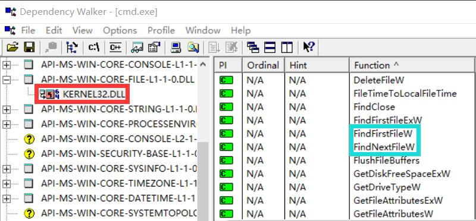

# API Hook

## 实验要求

- [x] 使用记事本写文件时，`hahaha`变成`hehehe`
- [ ] `dir`遍历，越过显示指定文件

## 实验过程

### hook WriteFile

- 使用`dumpbin /imports C:/Windows/SysWOW64/notepad.exe`
  - `WriteFile`位于`KERNEL32.DLL`
- [IATHook](https://github.com/tinysec/iathook/blob/master/IATHook.c)使用第三方提供的函数
- 编写`hook-WriteFile.c`，并生成`hooklib.dll`（由于并不需要导出函数，因此其`exp.def`仅含有`LIBRARY  hooklib`一条语句）
- 该 DLL 使得其被加载时执行`IATHook`操作，从而将原`WriteFlie`函数的地址替换为`Fake_WriteFile`函数的地址
    ```c
    // hook-WriteFile.c
    #include<Windows.h>

    // 函数定义在 IATHook.c 中
    LONG IATHook(
        __in_opt void* pImageBase,
        __in_opt char* pszImportDllName,
        __in char* pszRoutineName,
        __in void* pFakeRoutine,
        __out HANDLE* phHook);

    void* GetIATHookOrign(__in HANDLE hHook);

    HANDLE g_hHook_WriteFile = NULL;
    typedef BOOL(__stdcall * LPFN_WriteFile)(HANDLE hFile, LPCVOID lpBuffer, DWORD nNumberOfBytesToWrite,
        LPDWORD lpNumberOfBytesWritten, LPOVERLAPPED lpOverlapped);

    BOOL __stdcall Fake_WriteFile(HANDLE hFile, LPCVOID lpBuffer, DWORD nNumberOfBytesToWrite,
        LPDWORD lpNumberOfBytesWritten, LPOVERLAPPED lpOverlapped)
    {
        LPFN_WriteFile fnOrigin = (LPFN_WriteFile)GetIATHookOrign(g_hHook_WriteFile);

        if (strcmp(lpBuffer, "hahaha") == 0)
            lpBuffer = "hehehe";

        // 调用原始的 WriteFile 函数
        return fnOrigin(hFile, lpBuffer, nNumberOfBytesToWrite, lpNumberOfBytesWritten, lpOverlapped);
    }

    BOOL WINAPI DllMain(
        HINSTANCE hinstDLL,  // handle to DLL module
        DWORD fdwReason,     // reason for calling function
        LPVOID lpReserved)  // reserved
    {
        // Perform actions based on the reason for calling.
        switch (fdwReason)
        {
        case DLL_PROCESS_ATTACH:
            // Initialize once for each new process.
            IATHook(
                GetModuleHandleW(NULL),
                "kernel32.dll",
                "WriteFile",
                Fake_WriteFile,
                &g_hHook_WriteFile
            );
            // Return FALSE to fail DLL load.
            break;
        }
        return TRUE;  // Successful DLL_PROCESS_ATTACH.
    }
    ```
- 为远程进程创建加载 DLL 的线程可以直接使用 [lab0x07 DLL Injection](../lab0x07&#32;DLL&#32;Injection/README.md) 中的攻击函数，但主函数中 DLL 的路径需要修改
- 注入成功、远程线程结束后，`IATHook`的效果对当前被注入进程永久有效
- 点击 GIF 查看 hook-WriteFile 完整操作视频<br>

  [](https://pan.baidu.com/s/1BvZz7kvtdoFDD0E78cTEXQ)

### hook FindNextFileW

- `cmd.exe`中的`dir`命令使用`FindFirstFileW`函数和`FindNextFileW`函数来遍历指定目录，并获得目录下所有文件
  - 使用`Dependency`查看，`FindFirstFileW`函数和`FindNextFileW`函数均位于`KERNEL32.DLL`（由于`KERNEL32.DLL`在`cmd.exe`的导入库中属于子模块，使用`dumpbin`无法获知，当然直接看文档也是可以的）

  

  - 后来经试验发现使用`KERNEL32.DLL`作为导入模块名会导致钩取失败
- `FindFirstFileW`函数用于获取目录句柄，遍历目录使用的是`FindNextFileW`函数，因此只需要钩取`FindNextFileW`函数

## 参考资料

- [iathook](https://github.com/tinysec/iathook)
- [WriteFile function](https://docs.microsoft.com/zh-cn/windows/win32/api/fileapi/nf-fileapi-writefile)
- [FindNextFileW function](https://docs.microsoft.com/zh-cn/windows/win32/api/fileapi/nf-fileapi-findnextfilew)
- [Listing the Files in a Directory](https://docs.microsoft.com/zh-cn/windows/win32/fileio/listing-the-files-in-a-directory)
- [wcscmp](http://www.cplusplus.com/reference/cwchar/wcscmp/)